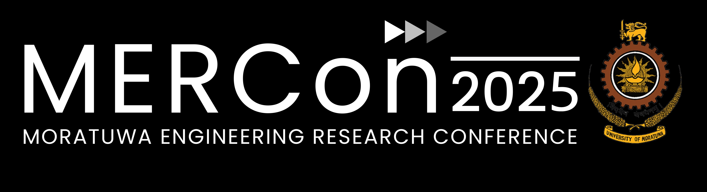

# TinyML: A Compact Revolution in Engineering AI  
**Workshop at MERCon 2025 – Moratuwa Engineering Research Conference**  

  

---

## About the Workshop  
As deep learning models grow in complexity, deploying them on **resource-constrained devices** requires **model optimization and efficient architectures**.  

In this workshop, you’ll learn:  
- 🔹 **Model compression** – pruning, quantization-aware training, post-training quantization, knowledge distillation  
- 🔹 **Efficient architectures** – improving speed, memory, and energy savings  
- 🔹 **Deployment** – running AI models on embedded & mobile devices  

This is a **hands-on and theory-integrated workshop** with a focus on **practical deployment** of TinyML in engineering applications.  

---

## Workshop Agenda with Resources  
| Time | Topic | Presenter | Resources |
|------|-------|-----------|-----------|
| **1:00 – 1:05 PM** | Intro to Panel | Dr. Dharshana Kasthurirathna |  |
| **1:05 – 1:15 PM** | Introduction to the Session | Mr. Asiri Gawesha | [📄 Slides - 01_Intro_to_TinyML.pdf](01_Intro_to_TinyML.pdf) |
| **1:15 – 2:00 PM** | Session 01 - Wet TinyML | Dr. Samitha | [📄 Slides](01_Intro_to_TinyML/slides/) |
| **2:00 – 3:30 PM** |Session 02 - Model Compression Techniques | Dr. Dinuka Sahabandu| [📄 Slides](02_Model_Compression_slides/) |
||||[Model_Pruning_(with_Quantization)_Student](https://colab.research.google.com/drive/1UMizpplQuarZJ0bvShieTHLQntN7lIrB?usp=sharing)|
||||[Knowledge_Distillation_(with_Pruning_and_Quantization)_Student](https://colab.research.google.com/drive/187Hk72vvGGGPz1qfmXwtJAd9bM-qflX9?usp=sharing)|
||||[Quantization_Techniques_(Integer,_Dynamic_Range,_and_Float_16)_Student](https://colab.research.google.com/drive/1WILvGD6VBysdsGTULz3eIpv6lwOQkgBb?usp=sharing)|
| **3:30 – 3:40 PM** | ☕ Break | — | — |
| **3:40 – 4:40 PM** |Session 03 - Model Deployment | Mr. Asiri Gawesha | [📄 Slides- 03_Coding sessions.pdf](03_Coding_session.pdf) |
||||[Headpose_pruning_quantization](https://colab.research.google.com/drive/10ASWBRY6BBQeoAljPHhPU5IjfqFX4pUI?usp=sharing)|
||||[PlantLeaves_mirco](https://colab.research.google.com/drive/1tYySJEYomYnqsYnt4F30ZaZTin4hB1n4?usp=sharing)|
|||| [Arduino Code - "tinyPlant" Directory](tinyPLant)|
| **4:40 – 4:10 PM** | Session 04 - Architectural Improvements | Mr. Sanka Mohottala | [📄 Slides](04_Architectural_Improvements/slides/) |
| **5:10 – 5:30 PM** | Session 05 - Energy-Efficient Architectures | Dr. Mahima Weerasinghe| [📄 Slides - 05_A_Revolution_in_Efficient_AI_EngineerinSNNs_MERCON_2025.pdf](05_A_Revolution_in_Efficient_AI_EngineerinSNNs_MERCON_2025.pdf) |
||||[📄 Synopsis](05_MERCON_SNN_Synopsis)|
||||[MerconSNN](https://colab.research.google.com/drive/1LIgIvrEgE3SpvtI4nblCk7K1mjYwsa1O?usp=sharing)|

<!-- ---

## 📱 Interactive Resources  
- **Google Colab** – Instant cloud execution of coding exercises (no local setup)  
- **TFLite Models** – Deploy models on microcontrollers and mobile devices   -->

---

## Facilitators  
- **Dr. Samitha Somathilaka** – University of Nebraska–Lincoln  
- **Dr. Dinuka Sahabandu** – University of Washington  
- **Dr. Mahima Weerasinghe** – SLIIT  
- **Mr. Asiri Gawesha** – Open University of Sri Lanka
- **Mr. Sanka Mohottala** – SLIIT  

>  *This repository is maintained by the TinyML Workshop Team as part of MERCon 2025.*
